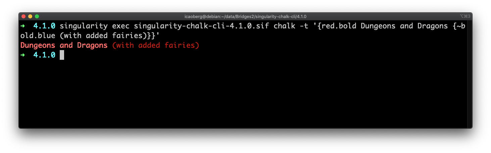

# singularity-chalk-cli


Singularity recipe for [chalk-cli](https://github.com/chalk/chalk-cli).

## Building the image using the recipe

### To build the image locally
Run the script `build.sh` to build image locally.

```
bash ./build.sh
```

### To build the image remotely
Run the script `rbuild.sh` to build image locally.

```
bash ./build.sh
```

## Installing the container on Bridges (or similar)
Copy the

* `SIF` file
* and the `chalk-cli` script

to `/opt/packages/chalk-cli/4.1.0`.

Copy the file `modulefile.lua` to `/opt/modules/chalk-cli` as `4.1.0.lua`.

### Example
```
singularity exec singularity-chalk-cli-4.1.0.sif chalk -t '{red.bold Dungeons and Dragons {~bold.blue (with added fairies)}}'
```



## Alternative Installation
```
spack install npm
spack load npm
npm install -g chalk-cli
```

---
Copyright © 2020-2023 Pittsburgh Supercomputing Center. All Rights Reserved.

[icaoberg](http://www.andrew.cmu.edu/~icaoberg) at the [Pittsburgh Supercomputing Center](http://www.psc.edu) in the [Mellon College of Science](https://www.cmu.edu/mcs/) at [Carnegie Mellon University](http://www.cmu.edu).
